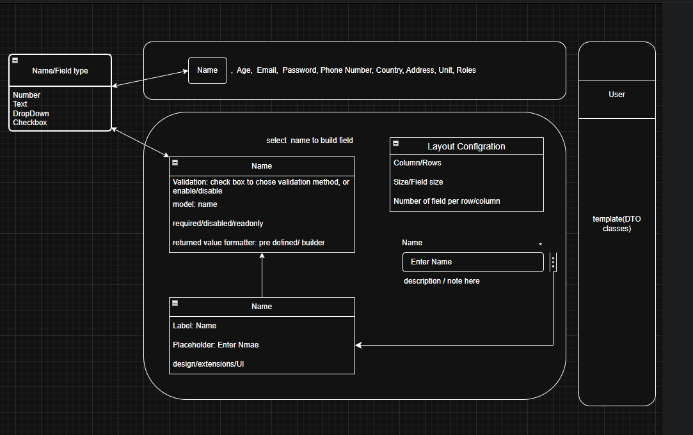

# Form Builder

## Main Points

- pre defined DTO classes
- field controller
- field type
- field props
- validation
- form layout

### pre defined DTO classes

this will be some logic that will return all DTO classes in the system.
couple of classes already defined we can access them and build a form from each class separately.
also we should have the ability to define a form from multiple DTO classes, that works together on one submit.

### field controller

a builder will define a controller wrapper over the field/fields this could be defined automatically when defining a new field

- default value
- model
- validation message
- reactivity
- data options
- search, filter
- disabled
- readonly

### field type

a builder that can create field to specific property or nested property in dto class.

- input/date/time/color ..
- checkbox/group
- dropdown
- toggle

### field props

a way to update the props after first creation.

- style
- shape
- extensions
- label
- placeholder

### validation

this will determine whether the validation will work on value change or on submit, and specify the fields that should be required to proceed
this will require some changes on the corello/tamam to be able to change the auto validation.

### form layout

apply some pre defined layout or customize it

#### simple example UI

> select a DTO class **=>** create new instance with default data **=>** represent all property **=>** select property **=>** open Field Builder Options **=>** choose the field type and other props **=>** apply changes **=>** new field added to the layout page.



### field builder concept

```js
// class uses builder pattern
class FieldBuilder {
// what is the type of field
type: text // an enum of field types => text/number/area/dropdown
// default value definer
definer: (object:type/* access root object */) => object.someKye  // could be promise formatter function
// extensions like on the left/right part as figure/text/icon
extensions:{ // will be valid only for fields that support extensions
leftFigure:{
    type:icon // an enum represent type icon/text/icon_text
    action: () => do something // could access the data
    icon: arrow //the icon from select options
    label: calc // if the type is text
},
rightFigure => leftFigure // same
}
description/note: string
label:string
title:string// on hover
accessKey: 'user.unit'// to determine model value & validator object
required: true // boolean to mark the field as required in the ui/ should be connected with validation
optionType: Enum// an enum to determine the type of options for dropdown/select field=> enum/list/promise
options: function (args:object /* access some useful args from the field */) => []/ Enum to array// allow to format static data (no promise)
fetchOption: new Promise().then //a promise to get the data for dropdown/select
fieldProps: /* InputHTML props */ {
style,
class,
//etc..
},
wrapperProps: /* divHTML props */ {
style,
class,
//etc..
}

}
```

> this class "FieldBuilder" will return an object to define a field with controller wrapper.

> we can create multiple class each one will define some data for eg. Controller component Builder => Basic Field Builder => Advance Builder


> the hole code will be a JSON file that can be converted to UI using some methodology